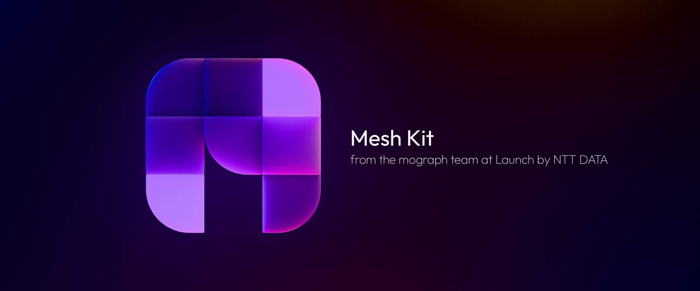
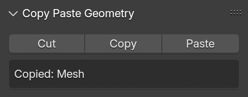
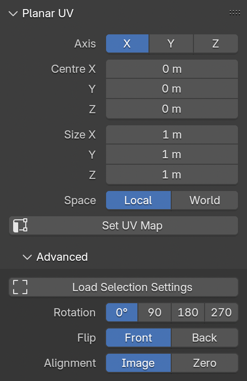
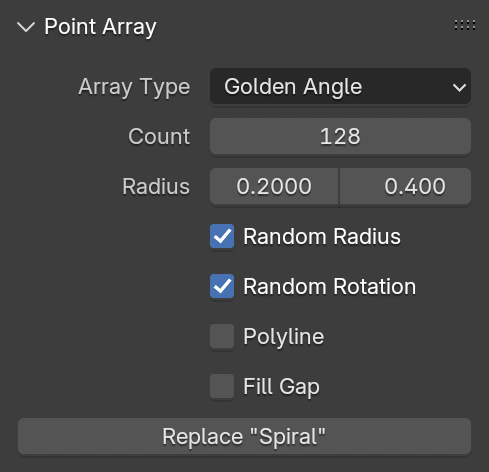
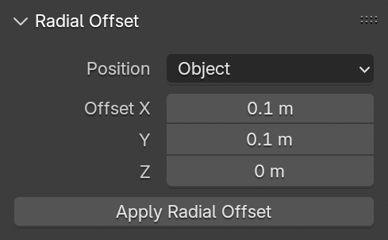
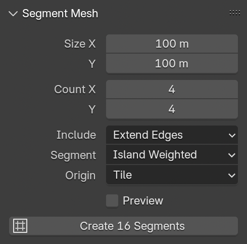
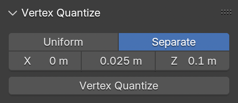

# Launch Mesh Kit — Blender Geometry Editing

## Features:

- ### Copy Paste

  - Stores geometry in a project-specific clipboard for easy copy/paste between mesh or curve objects

    

- ### Planar UV

  - Projects UV coordinates from a specified axis using numerical scale inputs for repeatability

    

- ### Point Array

  - Generates vertex point arrays in various patterns, including cubic grid, golden spiral, poisson packing, and volume field data

    

- ### Radial Offset

  - Offsets vertices using radial coordinates, useful for increasing radial scales by a specified distance

    

- ### Segment Mesh

  - Breaks up large contiguous meshes into chunks, useful for partitioning maps for use in game engines

    

- ### Vertex Quantize

  - Snaps vertices to customisable XYZ steps

    

## Installation via Extensions Platform:

- Go to Blender Preferences > Get Extensions > Repositories > **＋** > Add Remote Repository
- Set the URL to `https://jeinselen.github.io/Launch-Blender-Extensions/index.json`
- Enable `Check for Updates on Start`
- Filter the available extensions for "Launch" and install as needed

## Installation via Drag-and-Drop:

- Click and drag one of the file links from the [repository list page](https://jeinselen.github.io/Launch-Blender-Extensions/) into Blender

## Installation via Download:

- Download the .zip file for a specific kit
- Drag-and-drop the file into Blender

These latter two methods will not connect to the centralised repository here on GitHub and updates will not be automatically available. If you don't need easy updates, don't want GitHub servers to be pinged when you start up Blender, or would just like to try some extensions without adding yet another repository to your Blender settings, this is the option for you.

## Notes:

Software is provided as-is with no warranty or provision of suitability. These are internal tools and are shared because we want to support an open community. Bug reports are welcomed, but we cannot commit to fixing or adding features. Not all features may be actively maintained, as they're updated on an as-needed basis.
